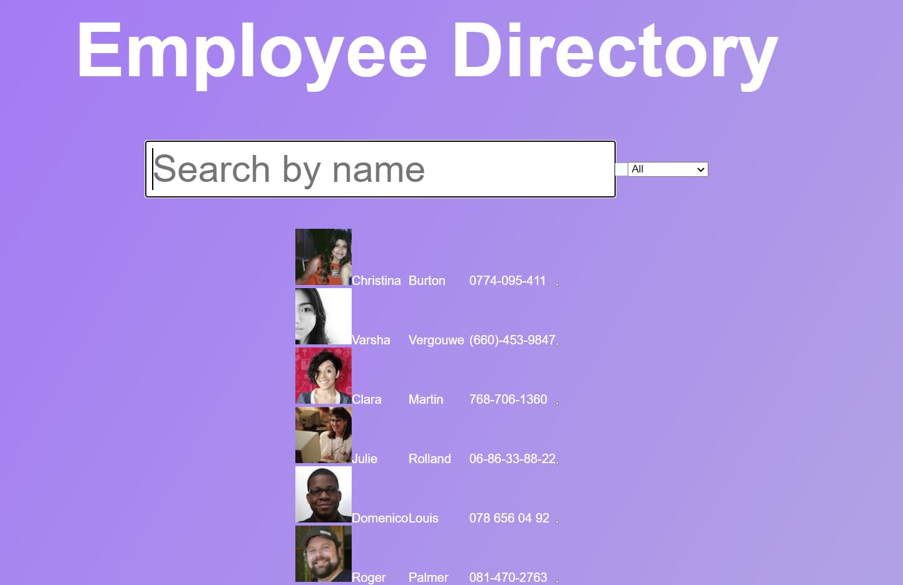

# Employee Directory

# Table of Contents

1. [Description](#Description)
2. [Application Preview](#Application-Preview)
3. [Application Link](#Application-Link)
4. [License](#License)
5. [Badges](#Badges)
6. [Contact](#Contact)

# Description

This is a employee directory application that was created with React
This application will allow to view the entire employee directory at once so that to have quick access to the employee's information. In the search bar you are to filter employees by their first and last name.

# Application Preview

Here is a preview of my web application:  

# Application Link

https://japluas93.github.io/react-employee-directory/

# License

[MIT](https://choosealicense.com/licenses/mit/)

# Badges

# Contact

If you have any additional questions, feel free to reach me at:  
[Github Profile](https://github.com/Japluas93)  
Email: [julianpluas@gmail.com]()
